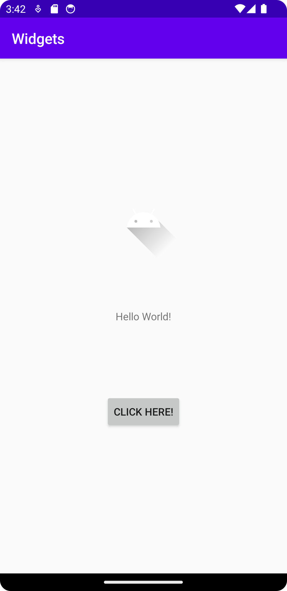

# Rapport

Jag valde att använda constraints för att positionera mina views. Jag har en ImageView, TextView och en ButtonView.

ImageView har en MarginTop 100dp för att flytta den lite närmare texten och 
ButtonView har en MarginBottom 100dp för att flytta den lite närmare texten

Så här ser alla 3 Views ut mer eller mindre
```
    <Button
        android:id="@+id/knapp"
        android:layout_width="wrap_content"
        android:layout_height="wrap_content"
        android:text="@string/click_here"
        app:layout_constraintBottom_toBottomOf="parent"
        app:layout_constraintEnd_toEndOf="parent"
        app:layout_constraintStart_toStartOf="parent"
        app:layout_constraintTop_toBottomOf="@+id/textView"
        android:layout_marginBottom="100dp">
    </Button>
```


